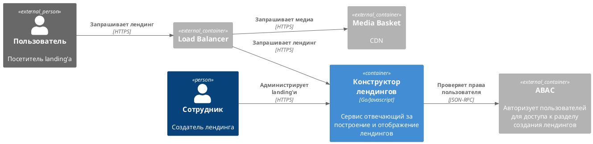
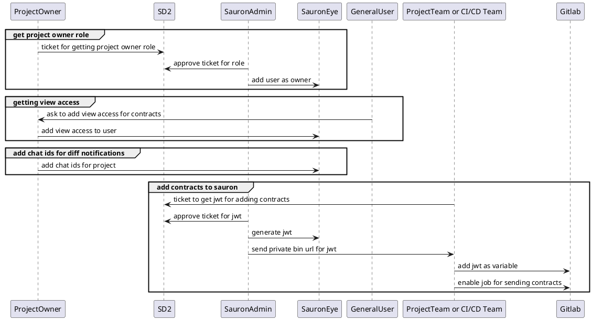

# Шаблон для составления ADR

# Краткое наименование ADR

## Контекст
 Опишите основную проблему или бизнес-задачу, которую необходимо решить с помощью архитектурного решения. Например, необходимость улучшить производительность системы или обеспечить интеграцию с новым внешним сервисом. Описание бизнес задачи производится по шаблону [Goals](/entities/docs/blank?dh-doc-id=seller.adrs.goals_template).

## Участники
| ФИО | Роль |
|-----------|-----------|
| [Имя Фамилия](https://ссылка_на_профиль)|    |

## Статус
Укажите статус, в котором на данный момент находится ADR.

| Статус       | Описание                                                                                     | Дата       |
|--------------|----------------------------------------------------------------------------------------------|------------|
| Draft        | ADR формируется и обсуждается, ещё не утверждена, возможны изменения перед стартом.          |            |
| In Progress  | Ведется активная работа над ADR                                                              |            |
| Done         | Завершена работа над ADR: согласовано с ИБ, получены экспертные оценки трудоемкости.         |            |
| Reject       | ADR отклонена на этапе ревью ИБ                                                              |            | 
  

## Решение
 Четко опишите предлагаемое вами архитектурное решение, включая основные элементы, такие как новые компоненты, интерфейсы, изменения в существующей архитектуре. Пропишите обоснование архитектурного решения и причины, по которым было выбрано именно это решение. Включает рассмотрение альтернатив и аргументацию в пользу выбранного пути.

## Альтернативы  
Описание предлагаемого решения должно включать в себя рассмотрение альтернативных вариантов.
В данном разделе опишите существующие альтернативы и объясните преимущества выбранного пути в сравнении с альтернативными вариантами.

| Альтернативный вариант | Плюсы | Минусы |
|------------------------|-------|--------|
|                        |       |        |

## Ограничения  
Зафиксируйте любые ограничения, которые могут ограничивать альтернативы, которые вы рассматриваете. Например, ограничения среды: принятые технологические стандарты, архитектура предприятия, общепринятые шаблоны и т. д. 

## Схемы
Отрисуйте следующие схемы (без фанатизма): 
- use case диаграмма ;
- контекстная диаграмма;
- диаграмма контейнеров;
- диаграмма последовательностей. 

Подробнее про [C4 model](https://c4model.com/). Для рисования желательно использовать [PlantUML](https://plantuml.com/ru/), но допускаются другие способы, подробнее [здесь](https://wikijs.wb.ru/ru/seller-portal/processes/arch-review/hints#как-рисовать-диаграммы).

**Пример дигараммы C4**

**Пример sequence диаграммы**

## Зависимости
Укажите, от какого другого архитектурного решения, компонента системы или команды зависит текущее решение. Например, интеграция с другим модулем или сервисом.
Опишите, на какие системы, модули или комады может повлиять принятое архитектурное  решения.

|Система/сервис | Описание зависимости |
|---------------|----------------------|
|               |                      |  

## Какие требования учтены
Перечислите основные требования, которые были учтены при разработке данного архитектурного решения (функциональные, нефункциональные, бизнес-требования).

| Группа требований | Формулировка тербования | Как учтено |
|-------------------|-------------------------|------------|
|                   |                         |            |
  
## Ожидаемые последствия от решения
Опишите, какие изменения произойдут в системе или бизнес-процессах после внедрения данного решения. Например, повышение производительности, улучшение безопасности, увеличение масштабируемости.

## Экспертная оценка трудоемкости
Опишите временные и ресурсные затратах на реализацию ADR.

## Техническая спецификация

| Параметр | Описание |
|-----------|-----------|
| **1. Логика**|*Какие бизнес-процессы самые важные в задаче?*|
| **2. Модель данных** | *Опишите модель данных* |
| **3. Нагрузка**||
| SLA | *Есть ли SLA?* |
| Производительность | *Необходимая задержка / пропускная способность системы* |
| Типы нагрузки | *Ожидаемая rt/nonrt нагрузка* |
| Объём данных | *Объём хранимых данных, их прирост* |
| **4. Интеграции** | *Укажите сервисы, с которыми интегрирована система* |
| **5. Пользователи API** | *Кто будет пользователями API? (Фронтенд, мобильные приложения, внутренние сервисы, ...)* |
| **6. Отказоустойчивость**||
| Транзакционность | *Везде ли предусмотрена транзакционность, где она нужна?* |
| Целостность данных| *Возможны ли ситуации, когда система потеряет данные?* |
| Операции с гарантированной идемпотентностью | *Перечислите операции записи, которые должны гарантировать идемпотентность и способ обеспечения этих гарантий. Например: Операция списания средств должна гарантировать идемпотентность через ID транзакции внутри запроса, чтобы не допустить повторного списания средств.* |
| Поведение при сбоях | *Как сервис себя ведет при отключении дата центра, базы-данных и других зависимых сервисов* |
| Обработка ошибок | *Как ведет себя система при единичной ошибке обработки запроса/сообщения* |
| Уровень критичности сервиса | *Укажите, по наблюдению за какими параметрам и при каких значениях считать, что произошла авария* |
| **7. Безопасность**||
| Данные | *С какими чувствительными данными будет работать система?* |
| Риски | *Где могут произойти утечки?* |
| **8. Риски** ||
| Сбои | *При каких обстоятельствах оно даст сбой?* |
| Масштабируемость | *Какой предел масштабирования у системы?* |
| Сложность | *Насколько система будет сложна в разработке и поддержке?* |
| **9. Ожидания** ||
| Требования заказчика | *Какие конкретно ожидания у заказчика к плановой дате запуска?* |
| Ограничения | *Что не входит в данное решение? Какие есть ограничения?* |
| **10. Наблюдаемость** ||
| Бизнес-метрики | *Нужны ли бизнес-метрики?* |
| Технические метрики | *Какие технические метрики и алерты, кроме стандартных, нужны?* |

## Промежуточные результаты
| Дата | Резульататы встреч |
|-----------|-----------|
|           |           |